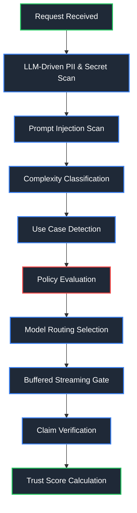
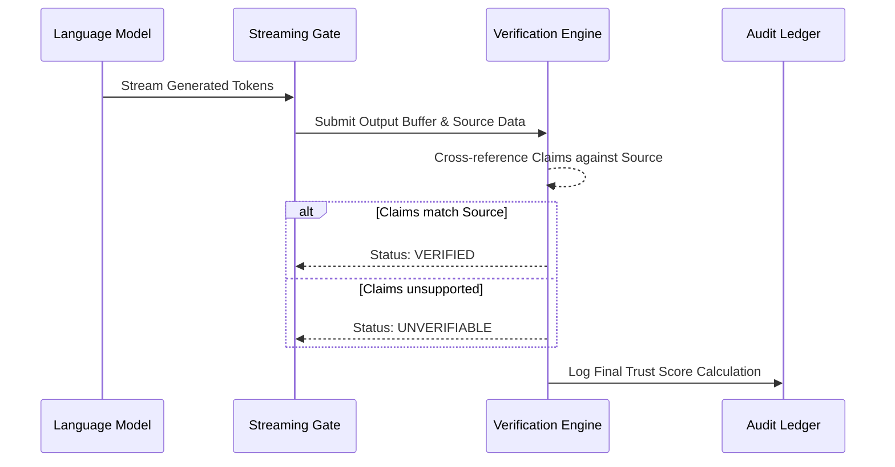

# ControlPlane.ai

ControlPlane is an enterprise-grade, real-time governance layer for artificial intelligence. Operating as an intermediary layer between prompt input and model production, it is engineered to detect risk, enforce dynamic policy routing, gate streaming outputs, systematically verify claims, and maintain a rigorous, replayable audit trail.

---

## File Structure

The repository is partitioned into distinct frontend and backend services to enforce strict separation of concerns.

| Component | Path | Purpose |
| --- | --- | --- |
| **Frontend Application** | `/frontend` | React 18 application providing the administrative console, interactive 3D landing page, and playground. |
| **Backend API** | `/backend` | FastAPI application responsible for orchestration, risk detection, event sourcing, and database communication. |
| **Database Migrations** | `/backend/migrations` | Alembic scripts for PostgreSQL schema management. |
| **Tests** | `/backend/tests` | Pytest suite validating backend components. |

---

## Technical Stack & Frameworks

The system is constructed using the following primary frameworks and libraries:

| Layer | Framework / Library | Primary Function |
| --- | --- | --- |
| **Frontend** | React 18, Vite | Component rendering, build tooling, and hot-module replacement. |
| | React Three Fiber | Procedural 3D rendering for the unauthenticated landing page. |
| | Framer Motion | Declarative micro-animations and transition handling. |
| | React Router DOM | Client-side routing and navigation. |
| | Recharts | High-performance SVG charting for dashboard analytics. |
| **Backend** | FastAPI | High-performance asynchronous REST API framework. |
| | Python 3.11+ | Core runtime environment. |
| | SQLAlchemy 2 | Asynchronous ORM for robust database querying and connection pooling. |
| | LiteLLM | Unified, provider-agnostic router for language model integration and security evaluation. |
| **Persistence** | PostgreSQL | Primary relational datastore and event-sourced ledger. |

---

## Core Pipeline Architecture

ControlPlane executes a deterministic ten-stage pipeline for every inbound request.



---

## Problem Solutions

### 1. Multi-Class Categorization & Intent Detection

In enterprise environments, prompts frequently traverse multiple distinct operational categories (e.g., Customer Support versus Internal HR Data). Applying a singular governance rule to all traffic is ineffective.

**Solution Architecture:**
ControlPlane utilizes a dedicated **Use Case Detection** cascade. Rather than treating all inputs identically, the orchestrator classifies the semantic intent of the prompt before selecting a rule set. 

| Process Step | Action | Outcome |
| --- | --- | --- |
| **Classification** | The prompt is analyzed to determine its primary operational context. | Assigned a distinct category label (e.g., `customer_support`, `decision_support`). |
| **Policy Mapping** | The assigned label is mapped to a specific, versioned Policy Profile. | Strict constraints are applied to sensitive categories, while internal queries receive flexible constraints. |
| **Risk Fusion** | Overlapping detector signals (e.g., Injection + PII) are aggregated. | A fused decision (Pass, Flag, Block, Human Review) is finalized prior to model routing. |

### 2. Context-Aware PII Detection via LLM Analysis

Traditional regex-based Personally Identifiable Information (PII) scanners produce an unacceptably high rate of false positives when analyzing natural language prompts, severely degrading the user experience.

**Solution Architecture:**
ControlPlane delegates PII detection to a fast, context-aware LLM evaluation layer via `LiteLLM`. The system transmits the prompt to an evaluator model instructed to analyze the semantic context and extract exact entities matching defined security types (e.g., emails, payment cards, SSNs, secrets). 

This eliminates the greedy nature of regular expressions, ensuring that abstract references or similar-looking numeric sequences are not incorrectly flagged as sensitive data.

### 3. Mitigating Hallucinations

Language models exhibit a well-documented tendency to fabricate information. Relying solely on the model's internal consistency is inadequate for enterprise deployment.

**Solution Architecture:**
ControlPlane addresses hallucination via post-generation validation and a calculated metric rather than opaque confidence numbers.



**The Trust Score:**
A numerical index (0-100) is dynamically calculated by penalizing the baseline score for every unverified claim, safety flag, and low-confidence assertion, establishing a quantifiable metric for factual integrity.

### 4. Use-Case-Specific Output Differentiation

Different operational categories require fundamentally different response formats. A customer support reply should be empathetic and action-oriented, while a decision support analysis must be structured with pros, cons, and explicit risk caveats.

**Solution Architecture:**
ControlPlane injects a **use-case-specific system prompt** into the LLM context window based on the classified intent of the inbound request. The system prompt is selected from a versioned registry (`SYSTEM_PROMPTS`) and prepended to the user prompt before routing to the model.

| Use Case | System Prompt Directive | Output Shape |
| --- | --- | --- |
| **Customer Support** | Empathetic, concise, action-oriented tone with numbered resolution steps. | Short paragraphs with a clear next action for the customer. |
| **Internal Knowledge** | Analytical tone with bullet-point findings and concrete recommended next steps. | Structured findings and actionable recommendations. |
| **Decision Support** | Formal tone with labelled Pros/Cons sections, explicit uncertainties, and a final Recommendation. | Balanced analysis document suitable for senior leadership. |

This ensures that identical models produce categorically distinct outputs depending on the governance context, without requiring separate model deployments.

### 5. High Scalability & Latency Reduction

Introducing an intermediary governance layer inherently risks adding unacceptable latency to inference requests. 

**Solution Architecture:**
ControlPlane mitigates performance bottlenecks through several architectural mandates:

* **Asynchronous Execution:** Pre-checks and external LLM evaluation calls are heavily parallelized and executed in non-blocking threads.
* **Append-Only Event Sourcing:** Database transactions are heavily optimized. The system utilizes an append-only event stream for auditing, eliminating the overhead of complex, locking updates on active request rows.
* **Stateless Operation:** The API layer is completely stateless. JWT tokens and separately hashed gateway keys manage authentication without requiring persistent session locks, allowing horizontal scaling behind load balancers.

---

## Operation Instructions

### Standard Deployment (Docker)

To initialize the entire stack (Frontend, API, and PostgreSQL database), utilize Docker Compose:

```bash
docker compose up --build -d
```

### Local Development Environment

**Frontend Start:**
```bash
cd frontend
npm install
npm run dev
```

**Backend Start:**
*(Requires an active PostgreSQL connection defined in `.env`)*
```bash
cd backend
python -m venv .venv 
. .venv/bin/activate
pip install -e '.[dev]'
uvicorn app.main:app --reload --host 0.0.0.0 --port 8000
```
